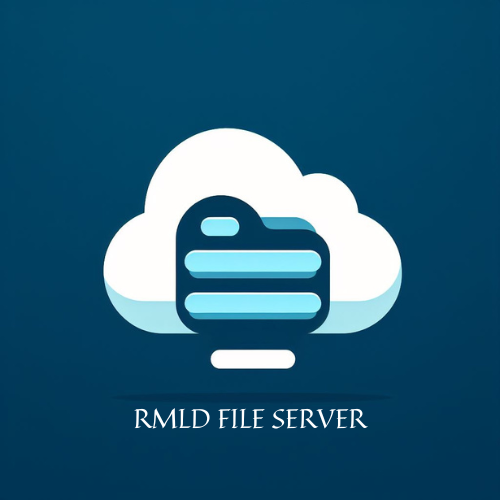

# RMLD File Server
<div align='center'>

</div>

RMLD File Server is a Django-based web application that allows users to upload, manage, and download files securely with the help of AWS S3 Buckets and ElephantSQL Postgres Cloud Services.

## Features

- User authentication: Users need to log in to upload and manage files.
- File Upload: Users can upload files with optional notes. The Backend will store your files will be in AWS S3 Buckets.
- File List: View a list of uploaded files with details.
- File Download: Download files uploaded by the user.
- File Deletion: Delete files uploaded by the user.
- Search: Search for files based on file names.
- View: You can preview/view the file in the browser itself without downloading to your local machine.
- Share: You can now share the link of the file to others for viewing purpose alone.
- Encryption: Provides URL Level Encryption, hence it improves security and user abstraction.
- File Storage Meter: Displays how much space has been consumed by each user.

## Prerequisites

- Python (3.6 or higher)
- Django (3.x)
- Additional Python packages (see `requirements.txt`)

## Setup

1. Clone the repository:
```bash
    git clone https://github.com/ravin-d-27/File_Transfer_Server.git
    cd File_Server
```

2. Create a virtual environment (recommended):
```bash
    python -m venv venv
    source venv/bin/activate  # On Windows: .\venv\Scripts\activate
```

3. Install dependencies:
```bash
    pip install -r requirements.txt
```

4. Apply database migrations:
```bash
    python manage.py makemigrations
    python manage.py migrate
```

5. Create your superuser account:
```bash
    python manage.py createsuperuser
```

6. Run the Development Server:
```bash
    python manage.py runserver
```

The application will be accessible at http://localhost:8000/.

## Usage

1) Log in to the application.
2) Upload files using the "Upload" section.
3) View and manage uploaded files in the "View" section.
4) Download or delete files as needed.

## Sample Credentials

To experience the RMLD File Server, you can use the following credentials:

- **Username:** sampleuser
- **Password:** samplesample@8

## Contributing

Feel free to contribute to this project by opening issues or pull requests. Your feedback and contributions are highly appreciated.

## License
This project is licensed under the MIT License - see the LICENSE file for details.
